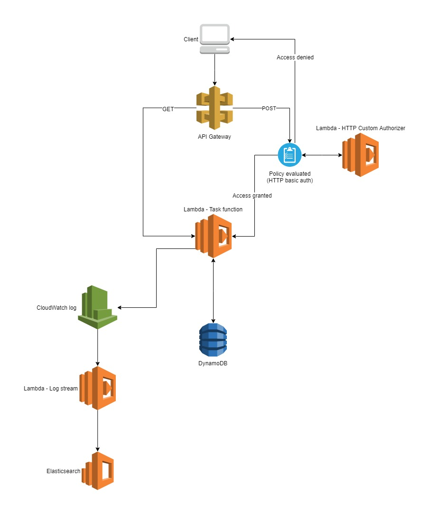

# Empatica challenge 2

## Architecture

## Requirements
+ Install [terraform](https://www.terraform.io/)
+ [Configure AWS cli credentials](https://docs.aws.amazon.com/cli/latest/userguide/cli-chap-configure.html#cli-quick-configuration)

## Usage
~~~~
terraform apply
~~~~

Example of POST request
~~~~
{
	"ID": 10,
	"Name": "Task 10"
}
~~~~

## Considerations
This project is for demonstration purpose only. Some choices have been made for ease and don't comply with security best practices.
+ Terraform uses AWS CLI credentials
+ At the beginning, the database (DynamoDB) used for storing the tasks is empty
+ HTTP Basic auth credentials are passed to the lambda function as environment variables (username: admin - password: secret)
+ No VPC created, therefore Elasticsearch has a public endpoint
+ No access to Elasticsearch from Internet, if want to do that you need to modify the policy allowing your public IP
+ If, in the request, there are more properties than required, they will be ignored
+ If you add an already existing task <em>ID</em> with a different <em>Name</em>, this will be replaced
